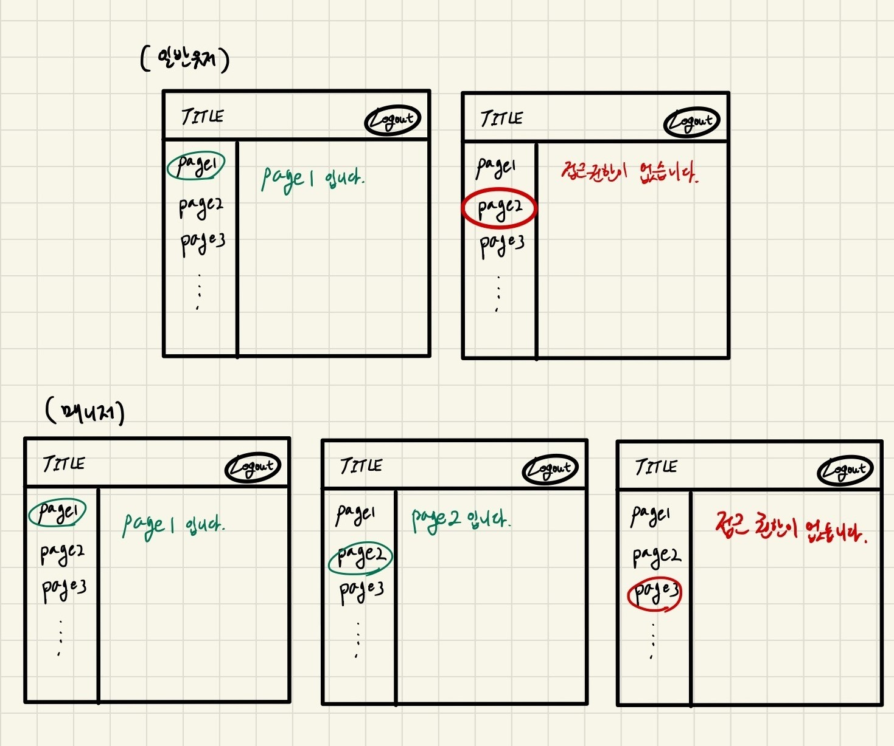

# 3월 원티드 프리온보딩 프론트엔드 과정 사전과제

## 목표 기간

- 2023.02.19 ~ 2023.02.24(6일)

## 구현 기능

1. CSR 방식으로 라우팅 기능있는 페이지 구현
2. (추가) 로그인 기능 구현

## 세부 조건

### 1. CSR 방식으로 라우팅 기능있는 페이지 구현

- [x] 라우팅 기능이 있는 페이지를 구현한다.
  - [x] 최소 3개의 페이지를 구현한다.
  - [x] 페이지가 라우팅될 때마다 페이지 최상단으로 스크롤이 이동한다.
- [x] 공통 레이아웃을 구현한다.
  - [x] sidebar, header 공통 레이아웃
  - [x] sidebar, header에는 적절한 데이터를 표시한다.
    - [x] sidebar : 내부 페이지
    - [x] header : title, 로그인 상태
- [x] 페이지별로 적절한 데이터를 표시한다.
  - [x] 페이지 이름
  - [ ] 접근 권한 여부

### 2. 로그인 기능 구현

- [ ] 권한별 더미 계정을 생성한다.
  - [ ] normal
  - [ ] manager
  - [ ] admin
- [ ] 로그인 UI 구현한다
- [ ] 로그인 기능을 구현한다.
  - [ ] 로그인 페이지를 구현한다.
    - [ ] 유저네임 - 비밀번호 입력
    - [ ] 로그인 버튼
  - [ ] 로그인 후에는 로그인 페이지로 이동하지 않는다.
  - [ ] 로그인 후에는 로그인 상태를 표시한다.

## 구현 화면(와이어 프레임)



## 빌드 및 실행 방법

```bash
yarn install && yarn dev
```

## 개발 환경

- Create React App -> Vite.js
- React Router
- typescript
- prettier, eslint
- (추가) Antd, 쏘카 디자인 시스템

## 기타

- 협업을 위한 기본 convention을 준수
  - code convention(추후 문서 추가)
  - commit / branch convention(추후 문서 추가)
  - issue, pull request convention(추후 문서 추가)
